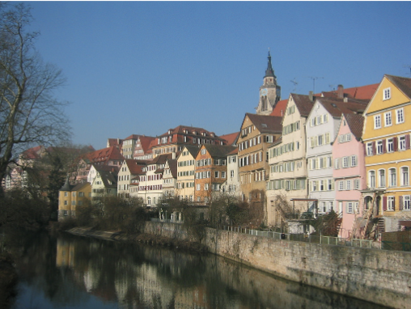
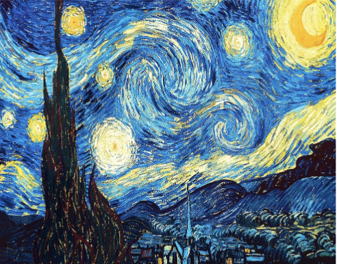
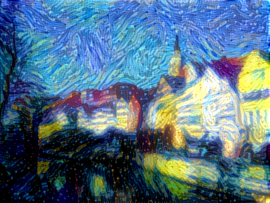
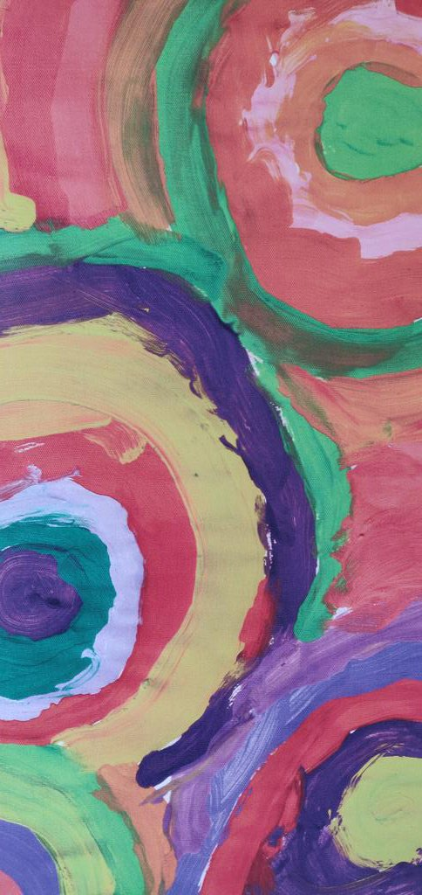
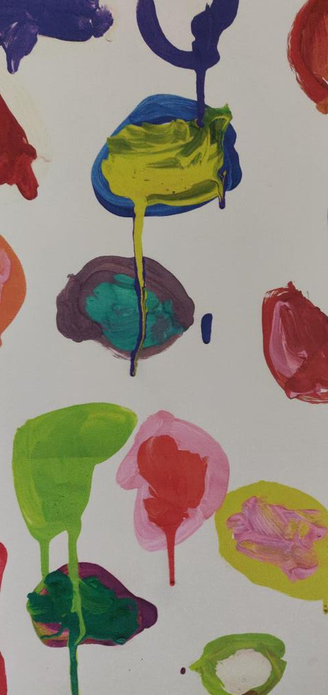
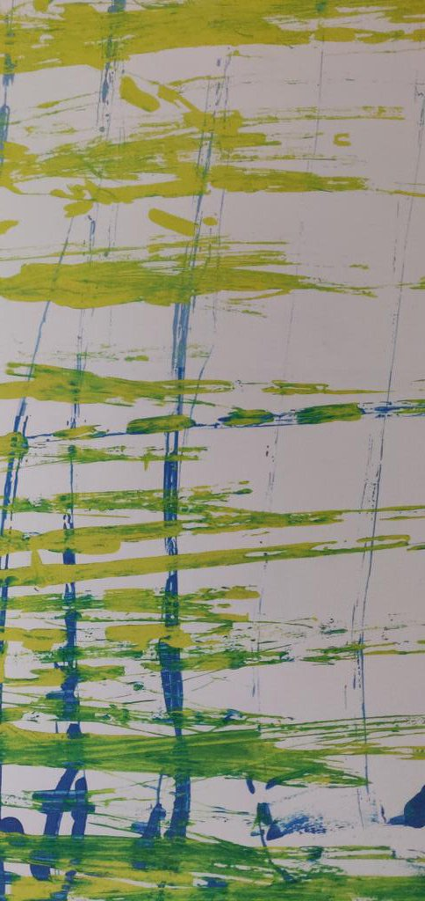
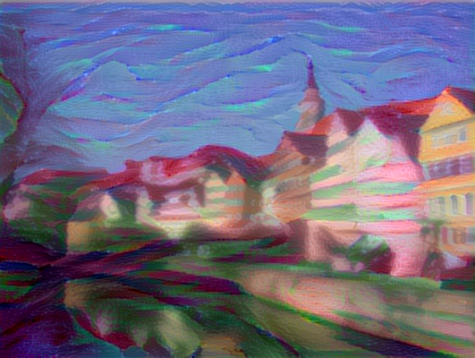
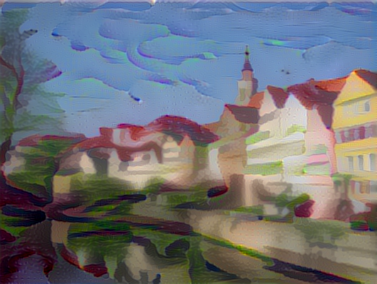
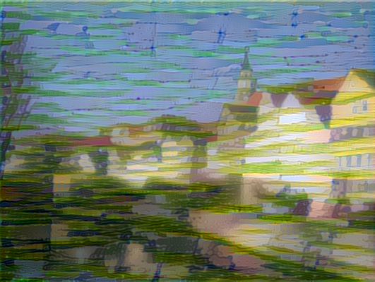

# Deep Style Transfer

Playing with Keras teams's code on some paintings that I realized during my youth :sweat_smile:.

Here are the basic usecase ([link to the notebook](https://nbviewer.jupyter.org/github/fchollet/deep-learning-with-python-notebooks/blob/master/8.3-neural-style-transfer.ipynb)).

Content|Style(Starry Night" by Vincent Van Gogh)|Result
:-------------------------:|:-------------------------:|:-------------------------:
|| 

Results are similar with other styles (paintings when I was kid):

Style 1|Style 2|Style 3
:-------------------------:|:-------------------------:|:-------------------------:
  |   | 

Result 1|Result 2|Result 3
:-------------------------:|:-------------------------:|:-------------------------:
 |   | 

